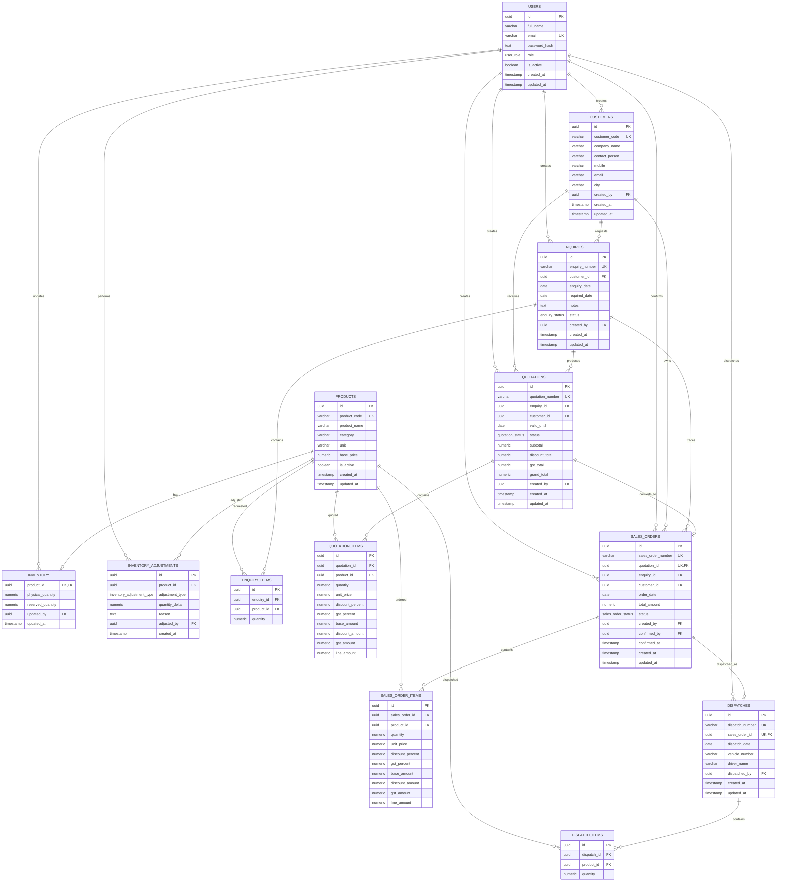

# Fundsroom ERP

## 1. Project Overview

Fundsroom ERP is a small ERP application for a manufacturing and industrial-supply company. It supports the core operational workflow:

```text
Customer Enquiry
      -> Quotation
      -> Sales Order
      -> Inventory Reservation
      -> Dispatch
```

The application includes a React frontend and an Express REST API backed by PostgreSQL. The backend remains the source of truth for calculations, statuses, permissions, inventory, and transactional operations.

## 2. Tech Stack

- React 19 with TypeScript
- Vite
- Node.js
- Express.js
- PostgreSQL
- Drizzle ORM and Drizzle Kit
- REST APIs
- JWT authentication
- Argon2id password hashing
- Zod request validation
- `decimal.js` for exact quotation and inventory quantity arithmetic
- Vitest and Supertest for automated tests

## 3. Features

- JWT authentication with session restoration
- ADMIN and SALES roles
- Backend-enforced role-based access control
- Customer creation and lookup
- Customer enquiry management
- Multiple products per enquiry
- Quotation creation from enquiries
- Server-side quotation calculation for subtotal, discounts, GST, line totals, and grand total
- Controlled quotation workflow: `DRAFT -> SENT -> ACCEPTED` or `REJECTED`
- Accepted quotation conversion into a Sales Order
- Duplicate Sales Order protection
- Sales Order confirmation by ADMIN
- Inventory availability calculation
- Transactional inventory reservation
- PostgreSQL row locking for reservation and dispatch operations
- ADMIN inventory receipt and correction adjustments
- Inventory adjustment audit records
- Negative-stock and reserved-stock safeguards
- Dispatch processing with vehicle and driver details
- Physical and reserved inventory updates during dispatch
- Protected REST APIs
- Zod validation and centralized API error handling
- Loading, empty, success, and error states in the frontend

## 4. User Roles

### ADMIN

- View customers, enquiries, quotations, Sales Orders, and inventory
- View inventory availability
- Adjust physical inventory through receipt or correction adjustments
- Confirm Sales Orders and reserve inventory
- Process dispatches

ADMIN does not create enquiries or quotations through the current SALES-only workflow.

### SALES

- Create customers
- Create enquiries with multiple products
- View customers, enquiries, quotations, Sales Orders, and inventory availability
- Create quotations
- Send, accept, or reject quotations through the controlled quotation workflow
- Convert accepted quotations into Sales Orders

SALES cannot adjust inventory, confirm Sales Orders, or process dispatches. Those operations are ADMIN-only and are enforced by the backend.

## 5. ERP Workflow

```text
Login
  -> Create or view enquiry
  -> Select customer and add one or more products
  -> Create quotation
  -> Send quotation
  -> Accept or reject quotation
  -> Convert an ACCEPTED quotation to a Sales Order
  -> ADMIN confirms the Sales Order
  -> Inventory is reserved
  -> ADMIN dispatches the order
  -> Physical and reserved inventory are updated
  -> Sales Order becomes DISPATCHED
```

## 6. Database Design

The database is relational and is defined in `src/db/schema/index.ts`.

| Table | Purpose and important relationships |
| --- | --- |
| `users` | Application users with `ADMIN` or `SALES` role. Email is unique. |
| `customers` | Customer master data, created by a user. Customer code is unique. |
| `products` | Product master data, including active state and base price. Product code is unique. |
| `inventory` | One inventory row per product with physical and reserved quantities. |
| `inventory_adjustments` | Audit record for ADMIN `RECEIVE` and `CORRECTION` stock changes. |
| `enquiries` | Customer enquiries with unique enquiry number, dates, notes, and status. |
| `enquiry_items` | Products and quantities belonging to an enquiry. Product is unique within an enquiry. |
| `quotations` | Commercial offers linked to an enquiry and customer with calculated totals and status. |
| `quotation_items` | Historical quotation product pricing, discounts, GST, and calculated amounts. |
| `sales_orders` | Orders created from accepted quotations and linked to customer, enquiry, and quotation. |
| `sales_order_items` | Historical order item snapshots copied from quotation items. |
| `dispatches` | Dispatch records linked one-to-one with a Sales Order. Dispatch number is unique. |
| `dispatch_items` | Products and quantities included in a dispatch. |

Important constraints include:

- Foreign keys protect customer, product, user, enquiry, quotation, Sales Order, and dispatch relationships.
- Enquiry, quotation, customer, product, Sales Order, and dispatch numbers are unique where applicable.
- Enquiry required date cannot precede enquiry date.
- Enquiry, quotation, Sales Order, and dispatch items use positive quantities.
- Quotation discount and GST percentages are constrained to `0..100`.
- Inventory physical and reserved quantities cannot be negative.
- Reserved inventory cannot exceed physical inventory.
- One quotation can create at most one Sales Order through the unique `sales_orders.quotation_id` constraint.
- One Sales Order can have at most one dispatch through the unique `dispatches.sales_order_id` constraint.

## Database ER Diagram

The following diagram reflects the current Drizzle/PostgreSQL schema. `PK` marks primary keys, `FK` marks foreign keys, and `UK` marks columns participating in unique constraints.



The primary business chain is `CUSTOMERS -> ENQUIRIES -> QUOTATIONS -> SALES_ORDERS -> DISPATCHES`. The item tables preserve the products and quantities at each stage, while `PRODUCTS` connects those snapshots to the product master and to the one-row-per-product `INVENTORY` table. `inventory_adjustments` records ADMIN stock receipts and corrections without replacing the current inventory balance.

Inventory availability is derived from the inventory row rather than stored as a separate column:

```text
available_quantity = physical_quantity - reserved_quantity
```

The database constraints prevent negative physical or reserved quantities and prevent reserved quantity from exceeding physical quantity. The composite unique constraints represented as `*_unique` in the diagram are defined on the relevant parent/product pairs: enquiry/product, quotation/product, Sales Order/product, and dispatch/product.

## 7. Inventory Logic

Available quantity is calculated rather than stored independently:

```text
Available Quantity = Physical Quantity - Reserved Quantity
```

Reservation:

- Increases `reserved_quantity`.
- Does not decrease `physical_quantity`.
- Rejects a request when available stock is insufficient.
- Locks inventory rows in a deterministic product order during transactional reservation.

Dispatch:

- Decreases `physical_quantity` by the dispatched quantity.
- Decreases `reserved_quantity` by the same quantity.
- Keeps logical available quantity consistent.
- Requires sufficient reserved inventory.

Stock adjustment:

- `RECEIVE` increases physical quantity and requires a positive delta.
- `CORRECTION` accepts a signed quantity delta.
- The resulting physical quantity cannot be negative or lower than reserved quantity.
- The inventory row and `inventory_adjustments` audit row are written transactionally.
- All inventory changes are persisted in PostgreSQL.

## 8. Authentication & Security

- Login uses `POST /api/auth/login`.
- Passwords are verified using Argon2id hashes.
- Successful authentication returns a JWT containing the user subject and role.
- Protected APIs require `Authorization: Bearer <token>`.
- JWT signatures and expiration are verified by backend middleware.
- Inactive users are rejected during authentication.
- The role is taken from the verified JWT and is never trusted from request input.
- Backend `requireRole` middleware enforces ADMIN and SALES restrictions.
- Password hashes, passwords, and JWT secrets are never returned to clients.
- The frontend hides unavailable actions for usability, but backend authorization remains the security boundary.

## 9. API Documentation

The complete endpoint reference is available in [docs/API.md](docs/API.md).

All routes below are mounted under the listed paths in `src/app.ts`.

| Method | Route | Purpose | Required role |
| --- | --- | --- | --- |
| `GET` | `/health` | API health check | Public |
| `POST` | `/api/auth/login` | Authenticate a user and issue a JWT | Public |
| `GET` | `/api/auth/me` | Return the authenticated user | Authenticated |
| `POST` | `/api/customers` | Create a customer | SALES |
| `GET` | `/api/customers` | List customers | ADMIN, SALES |
| `GET` | `/api/customers/:id` | Get one customer | ADMIN, SALES |
| `POST` | `/api/enquiries` | Create an enquiry with items | SALES |
| `GET` | `/api/enquiries` | List enquiries and items | ADMIN, SALES |
| `GET` | `/api/enquiries/:id` | Get one enquiry and items | ADMIN, SALES |
| `POST` | `/api/quotations` | Create a quotation from an enquiry | SALES |
| `GET` | `/api/quotations` | List quotations with details | ADMIN, SALES |
| `GET` | `/api/quotations/:id` | Get one quotation with details | ADMIN, SALES |
| `PATCH` | `/api/quotations/:id/status` | Apply a controlled quotation status transition | SALES |
| `POST` | `/api/quotations/:id/convert` | Convert an accepted quotation to a Sales Order | SALES |
| `GET` | `/api/inventory/availability` | View physical, reserved, and available inventory | ADMIN, SALES |
| `PATCH` | `/api/inventory/:productId/adjust` | Receive or correct physical inventory | ADMIN |
| `GET` | `/api/sales-orders` | List Sales Orders with details | ADMIN, SALES |
| `GET` | `/api/sales-orders/:id` | Get one Sales Order with details | ADMIN, SALES |
| `POST` | `/api/sales-orders/:id/confirm` | Confirm an order and reserve inventory | ADMIN |
| `POST` | `/api/sales-orders/:id/dispatch` | Dispatch a confirmed order | ADMIN |

## 10. Project Structure

```text
src/
  app.ts                 Express application and route mounting
  server.ts              Backend process entrypoint
  config/                Environment validation
  controllers/           HTTP request/response handlers
  db/                    PostgreSQL client, migrations, seed, and schema
  errors/                Consistent API error type
  middleware/            Authentication, RBAC, 404, and error middleware
  repositories/          Drizzle database access
  routes/                REST route definitions
  schemas/               Zod request schemas
  services/              Business workflows and transactions
  utils/                 Shared helpers and exact calculations

frontend/
  src/api/               Centralized API client and resource methods
  src/components/        Layout and reusable UI components
  src/context/           Authentication context
  src/pages/             Login, Enquiries, Quotations, Sales Orders, Inventory
  src/routes/             Protected route handling
  src/types/              Frontend API models
  src/App.tsx             Frontend route configuration
  src/main.tsx            React entrypoint
  src/styles.css         Responsive ERP styling
```

## 11. Environment Variables

Copy `.env.example` to `.env` and provide local development values. Never commit `.env` or real secrets.

```dotenv
DATABASE_URL=postgresql://...
JWT_SECRET=...
JWT_EXPIRES_IN=1h
PORT=3000
NODE_ENV=development
CORS_ORIGIN=http://localhost:5173

POSTGRES_DB=...
POSTGRES_USER=...
POSTGRES_PASSWORD=...
POSTGRES_PORT=5432

SEED_ADMIN_PASSWORD=...
SEED_SALES_PASSWORD=...
```

`DATABASE_URL`, `JWT_SECRET`, and `JWT_EXPIRES_IN` are required by backend startup. Seed passwords are required only by the seed script.

## 12. Database Setup

Run these commands from the repository root:

```powershell
npm run db:check
npm run db:migrate
npm run db:seed
```

- `db:check` verifies the PostgreSQL connection.
- `db:migrate` applies the existing Drizzle migrations from `drizzle/`.
- `db:seed` creates or updates development users, products, inventory, and customers.
- `db:generate` generates a new Drizzle migration from schema changes.

These commands do not intentionally drop existing tables or databases.

## 13. Running the Backend

From the repository root:

```powershell
npm run dev
```

For a normal start:

```powershell
npm start
```

The backend uses `PORT`, which defaults to `3000` when not otherwise configured.

## 14. Running the Frontend

From the repository root:

```powershell
npm run frontend:dev
```

Or from the frontend directory:

```powershell
cd frontend
npm run dev
```

The Vite development server uses port `5173`.

Frontend-specific commands:

```powershell
npm run frontend:typecheck
npm run frontend:test
npm run frontend:build
```

The frontend API client defaults to `http://localhost:3000/api`. Set `VITE_API_BASE_URL` when a different backend URL is required.

## 15. Test Suite

Backend commands from the repository root:

```powershell
npm run typecheck
npm test
```

Frontend commands:

```powershell
cd frontend
npm run typecheck
npm test
```

Current verified status:

- Backend tests: **89 passed**
- Frontend tests: **16 passed**
- Backend typecheck: **passed**
- Frontend typecheck: **passed**
- Production build: **passed**

The root build command runs the frontend production build:

```powershell
npm run build
```

## 16. Test Coverage / Business Rules

The automated suite covers:

- Successful and invalid authentication
- Inactive users and invalid/expired JWTs
- ADMIN and SALES authorization boundaries
- Customer and enquiry validation
- Multiple enquiry products and transactional creation
- Exact quotation calculations using decimal arithmetic
- Client grand-total tampering protection
- Invalid quotation status transitions
- Accepted quotation conversion
- Duplicate Sales Order prevention
- Historical Sales Order item snapshots
- Inventory reservation limits and multi-product reservation
- Transaction rollback on failed item or inventory updates
- Dispatch inventory deductions and status transitions
- Duplicate dispatch and concurrent-operation protection at the service-test boundary
- ADMIN stock receipt and correction adjustments
- Negative physical stock and physical-below-reserved validation
- Inventory adjustment audit rollback
- Frontend login, protected routes, loading/error states, role-specific actions, API response normalization, and Inventory UI behavior

## 17. Demo Flow

1. Start PostgreSQL and configure `.env`.
2. Run migrations and seed development data.
3. Start the backend and frontend.
4. Login as SALES.
5. Create or select a customer.
6. Create an enquiry with one or more products.
7. Create a quotation.
8. Send the quotation.
9. Accept or reject the quotation.
10. Convert an accepted quotation to a Sales Order.
11. Logout and login as ADMIN.
12. Confirm the Sales Order to reserve inventory.
13. Optionally adjust physical inventory through the ADMIN Inventory page.
14. Dispatch the confirmed order with vehicle and driver details.
15. Verify the Sales Order is `DISPATCHED` and inventory quantities are updated.

## 18. Test Login Credentials

The seed script defines these development/demo login emails:

| Role | Email |
| --- | --- |
| ADMIN | `admin@fundsroom.local` |
| SALES | `sales@fundsroom.local` |

Passwords are supplied through the local `SEED_ADMIN_PASSWORD` and `SEED_SALES_PASSWORD` environment variables. Real password values are intentionally not documented here.

## 19. Submission Checklist

- [x] Backend source code
- [x] React frontend source code
- [x] README documentation
- [x] PostgreSQL/Drizzle schema and migrations
- [x] API documentation
- [x] Automated backend tests
- [x] Automated frontend tests
- [x] Environment configuration template
- [ ] Database ER diagram artifact
- [ ] Demo video

## 20. Known Limitations / Scope

This project intentionally focuses on the required ERP workflow for the technical case study rather than implementing a complete enterprise ERP product. It does not include a customer-facing portal, payments, email/notification systems, analytics dashboards, mobile applications, or unrelated reporting modules.

The frontend is an internal operations interface. Customer acceptance is represented by the authenticated quotation status workflow; there is no separate customer login or customer-facing acceptance portal.

Concurrency behavior is implemented with PostgreSQL transactions and row locking. The automated tests cover service-level concurrency simulations; live deployment environments should also run database-backed concurrency tests as part of operational verification.
